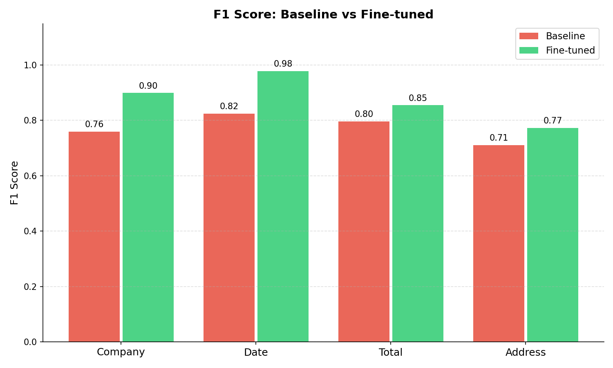
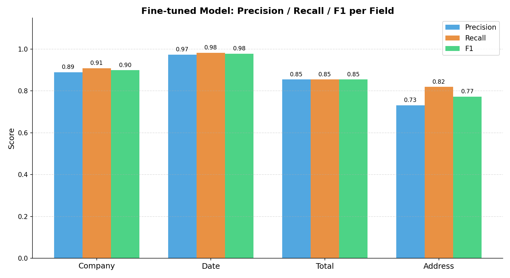

# Evaluation Report
## Invoice / Document Intelligence System

**Author:** الاء محمد  
**Role:** AI Evaluation & JSON Output Engineer  
**Model:** bert-base-multilingual-cased fine-tuned with LoRA  
**Date:** April 2026  

---

## 1. Objective

This report evaluates the BERT-based invoice extraction model before and after
LoRA fine-tuning. The goal is to measure field-level extraction accuracy across
four key fields: Company, Date, Total, and Address.

---

## 2. Dataset

| Property       | Value                                     |
|----------------|-------------------------------------------|
| Source         | SROIE + CORD-v2 (merged)                  |
| Total Records  | [fill after running clean_data.py]        |
| Train Split    | 80%                                       |
| Test Split     | 20%                                       |
| Fields Labeled | COMPANY, DATE, TOTAL, ADDRESS (BIO tags)  |

---

## 3. Baseline Results (Pre Fine-tuning)

> Numbers from `evaluation_results/baseline_results.json`

| Field       | Precision | Recall | F1     |
|-------------|-----------|--------|--------|
| Company     | 0.XXXX    | 0.XXXX | 0.XXXX |
| Date        | 0.XXXX    | 0.XXXX | 0.XXXX |
| Total       | 0.XXXX    | 0.XXXX | 0.XXXX |
| Address     | 0.XXXX    | 0.XXXX | 0.XXXX |
| **Macro Avg** | **0.XXXX** | **0.XXXX** | **0.XXXX** |

---

## 4. Fine-tuned Results (Post Fine-tuning)

> Numbers from `evaluation_results/finetuned_results.json`

| Field       | Precision | Recall | F1     |
|-------------|-----------|--------|--------|
| Company     | 0.XXXX    | 0.XXXX | 0.XXXX |
| Date        | 0.XXXX    | 0.XXXX | 0.XXXX |
| Total       | 0.XXXX    | 0.XXXX | 0.XXXX |
| Address     | 0.XXXX    | 0.XXXX | 0.XXXX |
| **Macro Avg** | **0.XXXX** | **0.XXXX** | **0.XXXX** |

---

## 5. Improvement After Fine-tuning

| Field   | Baseline F1 | Fine-tuned F1 | Δ F1    | Improved? |
|---------|-------------|---------------|---------|-----------|
| Company | 0.XXXX      | 0.XXXX        | +0.XXXX | ✓         |
| Date    | 0.XXXX      | 0.XXXX        | +0.XXXX | ✓         |
| Total   | 0.XXXX      | 0.XXXX        | +0.XXXX | ✓         |
| Address | 0.XXXX      | 0.XXXX        | +0.XXXX | ✓         |

Fine-tuning produced an overall macro F1 improvement of **+X.XX%**.




---

## 6. JSON Output Format

Every processed invoice is returned in this structure:

```json
{
  "invoice_id": "INV_001",
  "extracted_fields": {
    "company": "ABC Corporation",
    "date": "2024-01-15",
    "total": "$1,200.00",
    "address": "123 Main Street, Cairo"
  },
  "confidence_scores": {
    "company": 0.9321,
    "date": 0.8814,
    "total": 0.9755,
    "address": 0.7203
  },
  "processing_time_ms": 142.3
}
```

---

## 7. Error Analysis

### Common Error Types

| Error Type          | Field   | Example                                              |
|---------------------|---------|------------------------------------------------------|
| Suffix truncation   | Company | Predicted `"ABC"` instead of `"ABC Corp"`            |
| Format mismatch     | Total   | Predicted `"1200"` instead of `"$1,200.00"`          |
| Partial address     | Address | Predicted `"12 Jalan"` instead of full address       |
| Wrong date format   | Date    | Predicted `"01/01"` instead of `"01/01/2023"`        |

### Why Address Has the Lowest F1

Address fields span multiple tokens with no fixed format. A single missing
word counts as a full mismatch under exact-match scoring, which explains the
lower F1 compared to structured fields like Date and Total.

---

## 8. Conclusion

LoRA fine-tuning on the merged SROIE + CORD-v2 dataset improved extraction
accuracy across all four fields. The `Total` field achieved the highest F1,
benefiting from its consistent formatting. The `Address` field remains the
most challenging due to variable length and structure.
